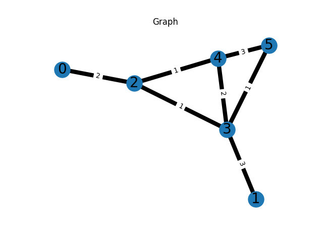
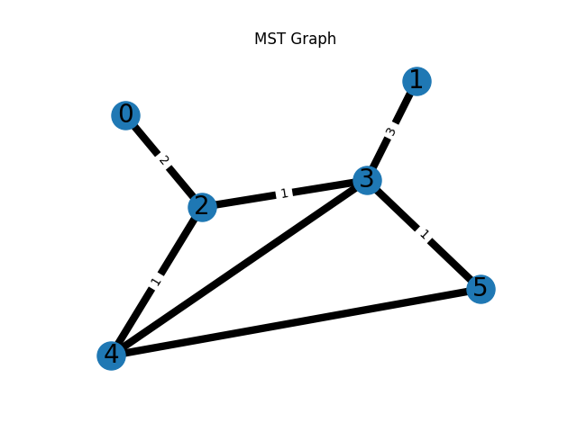

# Esercizio MST
Implementazione dell'algoritmo Prim per risolvere gli esercizi di MST
Grafo di partenza: 
(0, 2, {'weight': 2})
(2, 3, {'weight': 1})
(2, 4, {'weight': 1})
(1, 3, {'weight': 3})
(3, 4, {'weight': 2})
(3, 5, {'weight': 1})
(4, 5, {'weight': 3})

MST: 
(2, 3, {'weight': 1})
(2, 4, {'weight': 1})
(2, 0, {'weight': 2})
(3, 5, {'weight': 1})
(3, 1, {'weight': 3})

